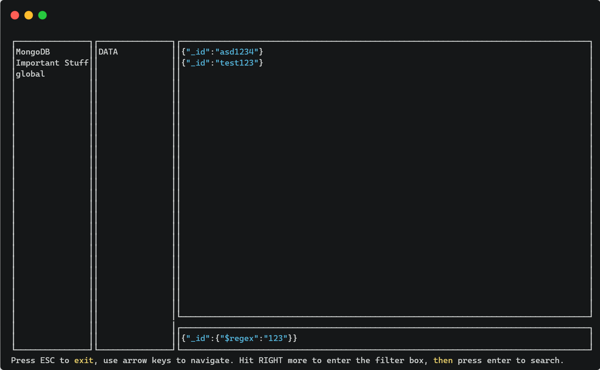

# mviewer
<div style="display: flex; justify-content: center"></div>

---

## MVIEWER is an ultra-basic TUI MongoDB browser made in Go.

An org I work for has strict policies on network access, so doing development/debugging on database infrastructure can be extremely slow and painful.

I built this tool as a quick & easy way to see if the changes/queries I'm making are working properly, while being SSH'd onto the server. It's read-only, no projections, no aggregations, only filters.

## Installation
```bash
go install github.com/Mexican-Man/mviewer@v0.1
```

## Usage

`mviewer -f <path/to/file>` (where `path/to/file` is a plaintext file containing your Mongo URI string)

-- or --

`mviewer -s <mongo-uri>`